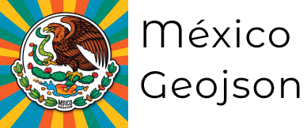

<!-- PROJECT SHIELDS -->
[![Contributors][contributors-shield]][contributors-url]
[![Forks][forks-shield]][forks-url]
[![Stargazers][stars-shield]][stars-url]
[![Issues][issues-shield]][issues-url]
[![MIT License][license-shield]][license-url]
[![LinkedIn][linkedin-shield]][linkedin-url]

<!-- PROJECT LOGO -->
 

  <h1 align="center">GeoJSON's de México</h1>

  

    
  

  

    GeoJSON de las colonias y estados de México
     
    <a href="https://github.com/open-mexico/mexico-geojson/issues">Report Bug</a>
    ·
    <a href="https://github.com/open-mexico/mexico-geojson/issues">Request Feature</a>
  

## 📍 Descripción

Repositorio completo de archivos GeoJSON que contiene la delimitación geográfica de todos los estados de México y sus respectivas colonias. Una herramienta esencial para análisis de datos geoespaciales, visualización de mapas y desarrollo de aplicaciones con información geográfica mexicana.

## 🎯 Objetivo

Proporcionar una fuente centralizada, confiable y actualizada de datos geográficos de México, facilitando el acceso a información territorial para desarrolladores, analistas de datos y profesionales que trabajan con sistemas de información geográfica (GIS).

## 🔍 Características

- Datos geográficos en formato GeoJSON
- Cobertura completa de estados mexicanos
- Información detallada de colonias
- Datos oficiales verificados
- Actualización periódica
- Fácil integración con herramientas GIS

## 📊 Fuente de Datos

Los datos son extraídos de fuentes oficiales del Servicio Postal Mexicano (SEPOMEX/Correos de México). El proceso incluye:

Los datos son sacadodos de los [datos publicos](https://datos.gob.mx/busca/dataset/ubicacion-de-codigos-postales-en-mexico) de correos de México; estos se descargan en formato `.kml` y posteriormente son convertidos a GeoJSON.

## 🔑 Palabras Clave
- GeoJSON México
- Datos geográficos mexicanos
- Mapas de estados México
- Colonias mexicanas
- Límites territoriales México
- Geodatos México
- Información geoespacial México
- Datos territoriales México
- Mapeo digital México
- GIS México

 

## **Herramientas Utilizadas**

* [MyGeodata](https://mygeodata.cloud/converter/kml-to-geojson)

## Uso

Su uso se ha pensado principalmente para analisis de datos y para uso en conjunto con el proyecto [MexPost](https://github.com/open-mexico/mexpost)

## Contribuir

Si encuentras un error o deseas mejorar algún archivo por favor sientete libre de ralizar un `Pull Request`

1. Fork the Project
2. Create your Feature Branch (`git checkout -b feature/AmazingFeature`)
3. Commit your Changes (`git commit -m 'Add some AmazingFeature'`)
4. Push to the Branch (`git push origin feature/AmazingFeature`)
5. Open a Pull Request

## Licencia 📄

Este proyecto está bajo la Licencia **MIT** - mira el archivo [LICENSE](LICENSE) para detalles

 

## Expresiones de Gratitud 🤗😻

* Comparte con otros éste proyecto 🗣📢
* Invitame una cerveza 🍺 o un café ☕😏
* Da las gracias públicamente 🤓
* etc 🤔🙃

 

---
**Made with ❤️  [macarthuror](https://github.com/macarthuror) - [@MacarthurOr](https://twitter.com/MacarthurOr) - arturo.ortegaro@gmail.com**

<!-- MARKDOWN LINKS & IMAGES -->
[contributors-shield]: https://img.shields.io/github/contributors/open-mexico/mexico-geojson?style=flat-square
[contributors-url]: https://github.com/open-mexico/mexico-geojson/graphs/contributors
[forks-shield]: https://img.shields.io/github/forks/open-mexico/mexico-geojson?style=flat-square
[forks-url]: https://github.com/open-mexico/mexico-geojson/network/members
[stars-shield]: https://img.shields.io/github/stars/open-mexico/mexico-geojson?style=flat-square
[stars-url]: https://github.com/open-mexico/mexico-geojson/stargazers
[issues-shield]: https://img.shields.io/github/issues/open-mexico/mexico-geojson?style=flat-square
[issues-url]: https://github.com/open-mexico/mexico-geojson/issues
[license-shield]: https://img.shields.io/github/license/open-mexico/mexico-geojson?style=flat-square
[license-url]: https://github.com/open-mexico/mexico-geojson/blob/master/LICENSE
[linkedin-shield]: https://img.shields.io/badge/-LinkedIn-black.svg?style=flat-square&logo=linkedin&colorB=555
[linkedin-url]: https://www.linkedin.com/in/macarthuror/
